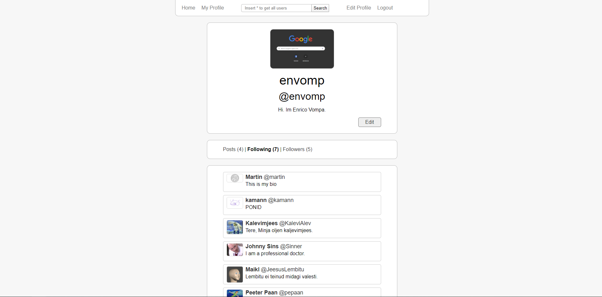

Python-cgi
---
1 player or 2 player pair matching card game.

[Play the game yourself](http://dijkstra.cs.ttu.ee/~envomp/cgi-bin/scoreboard.py)

PHP-twitter
---
Mock of twitter.

[Tweet something](http://dijkstra.cs.ttu.ee/~envomp/prax4/public_html/)

NodeJS Tic-Tac-Toe
---
Tic-Tac-Toe using web sockets

[Play the game yourself](http://dijkstra.cs.ttu.ee/~envomp/prax5/public/index.html)

